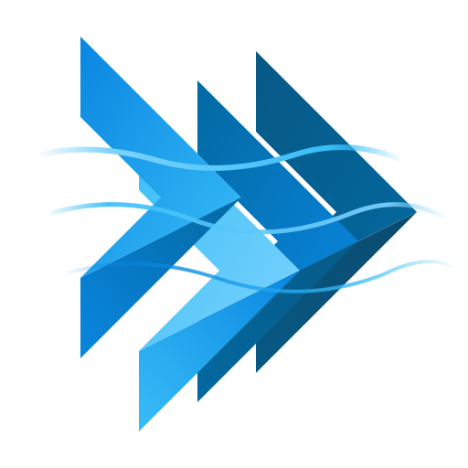

<p align="center">
  
</p>

<h1 align="center">Wind</h1>

<p align="center">
  <strong>Utility-first styling for Flutter, inspired by Tailwind CSS.</strong><br/>
  Build beautiful, responsive UIs with familiar className syntax — no more nested style objects.
</p>

<p align="center">
  <a href="https://pub.dev/packages/fluttersdk_wind"></a>
  <a href="https://github.com/fluttersdk/wind/actions"></a>
  <a href="https://opensource.org/licenses/MIT"></a>
  <a href="https://pub.dev/packages/fluttersdk_wind/score"></a>
  <a href="https://github.com/fluttersdk/wind/stargazers"></a>
</p>

<p align="center">
  <a href="https://wind.fluttersdk.com">Documentation</a> ·
  <a href="https://wind.fluttersdk.com/play">Playground</a> ·
  <a href="https://pub.dev/packages/fluttersdk_wind">pub.dev</a> ·
  <a href="https://github.com/fluttersdk/wind/issues">Issues</a>
</p>

---

> **Alpha Release** — v1 is under active development. APIs may change before stable. [Star the repo](https://github.com/fluttersdk/wind) to follow progress.

## Why Wind?

Flutter's styling is powerful but verbose. A simple card with padding, rounded corners, and a shadow requires deeply nested `Container`, `BoxDecoration`, `EdgeInsets`, and `BorderRadius` objects.

**Wind fixes this.** Write the same UI in one line:

```dart
// Before — Flutter way
Container(
  padding: EdgeInsets.all(24),
  decoration: BoxDecoration(
    color: Colors.white,
    borderRadius: BorderRadius.circular(12),
    boxShadow: [BoxShadow(blurRadius: 10, color: Colors.black12)],
  ),
  child: Text('Hello', style: TextStyle(fontSize: 20, fontWeight: FontWeight.bold)),
)

// After — Wind way
WDiv(
  className: 'bg-white rounded-xl shadow-lg p-6',
  child: WText('Hello', className: 'text-xl font-bold'),
)
```

If you know Tailwind CSS, you already know Wind.

## Features

| | Feature | Description |
|:--|:--------|:------------|
| 🧩 | **20 Widgets** | `WDiv`, `WText`, `WButton`, `WInput`, `WSelect`, `WPopover`, `WDynamic` and more |
| 🎨 | **Tailwind Syntax** | Same utility classes: `flex`, `p-4`, `bg-blue-500`, `rounded-lg`, `shadow-md` |
| 📱 | **Responsive** | `sm:`, `md:`, `lg:`, `xl:`, `2xl:` breakpoint prefixes |
| 🌙 | **Dark Mode** | `dark:` prefix with runtime toggle via `context.windTheme.toggleTheme()` |
| 🎯 | **State Styling** | `hover:`, `focus:`, `disabled:`, `loading:`, and custom state prefixes |
| 🔌 | **Platform Prefixes** | `ios:`, `android:`, `web:`, `mobile:` conditional styling |
| 🎭 | **Theme System** | Customizable token scales — colors, spacing, typography, shadows, and more |
| 📡 | **Server-Driven UI** | `WDynamic` renders widget trees from JSON — build UIs without app updates |

## Quick Start

### 1. Install

```bash
flutter pub add fluttersdk_wind
```

### 2. Wrap with WindTheme

```dart
import 'package:fluttersdk_wind/fluttersdk_wind.dart';

void main() => runApp(const MyApp());

class MyApp extends StatelessWidget {
  const MyApp({super.key});

  @override
  Widget build(BuildContext context) {
    return WindTheme(
      data: WindThemeData(),
      builder: (context, controller) => MaterialApp(
        theme: controller.toThemeData(),
        home: const HomePage(),
      ),
    );
  }
}
```

### 3. Build with className

```dart
class HomePage extends StatelessWidget {
  const HomePage({super.key});

  @override
  Widget build(BuildContext context) {
    return Scaffold(
      body: WDiv(
        className: 'flex flex-col gap-6 p-6 bg-gray-50 dark:bg-gray-900 min-h-screen',
        children: [
          WText(
            'Welcome to Wind',
            className: 'text-3xl font-bold text-gray-900 dark:text-white',
          ),
          WDiv(
            className: 'bg-white dark:bg-gray-800 rounded-xl shadow-lg p-6',
            child: WText(
              'Utility-first styling, right in Flutter.',
              className: 'text-gray-600 dark:text-gray-300',
            ),
          ),
          WButton(
            onTap: () => print('Wind!'),
            className: 'bg-blue-600 hover:bg-blue-700 text-white px-6 py-3 rounded-lg',
            child: Text('Get Started'),
          ),
        ],
      ),
    );
  }
}
```

## Widgets

### Layout & Container

```dart
// Flex row with gap
WDiv(
  className: 'flex flex-row gap-4 p-4 bg-white rounded-lg shadow',
  children: [sidebar, content],
)

// Responsive grid
WDiv(
  className: 'grid grid-cols-1 md:grid-cols-3 gap-6',
  children: cards,
)

// Scrollable container
WDiv(
  className: 'w-full h-full overflow-y-auto p-4',
  child: longContent,
)
```

### Typography

```dart
WText('Heading', className: 'text-2xl font-bold text-gray-900 dark:text-white')
WText('Body text', className: 'text-base text-gray-600 leading-relaxed')
WText('LABEL', className: 'text-xs font-semibold uppercase tracking-wider text-gray-500')
```

### Forms

```dart
// Text input with focus ring
WFormInput(
  label: 'Email',
  value: _email,
  onChanged: (v) => setState(() => _email = v),
  className: 'p-3 border rounded-lg focus:ring-2 focus:ring-blue-500',
)

// Searchable dropdown
WFormSelect<String>(
  label: 'Country',
  value: _country,
  options: countries,
  onChange: (v) => setState(() => _country = v),
  searchable: true,
)

// Date picker
WFormDatePicker(
  label: 'Start Date',
  value: _date,
  onChanged: (v) => setState(() => _date = v),
)
```

### Interactive

```dart
// Button with loading state
WButton(
  onTap: _submit,
  isLoading: _isSubmitting,
  className: 'bg-blue-600 hover:bg-blue-700 loading:bg-blue-400 text-white px-6 py-3 rounded-lg',
  child: Text('Submit'),
)

// Popover menu
WPopover(
  alignment: PopoverAlignment.bottomRight,
  className: 'w-64 bg-white dark:bg-gray-800 rounded-lg shadow-xl p-2',
  triggerBuilder: (context, isOpen, isHovering) => WButton(
    className: 'bg-gray-100 hover:bg-gray-200 px-4 py-2 rounded-lg',
    child: Text('Menu'),
  ),
  contentBuilder: (context, close) => Column(
    mainAxisSize: MainAxisSize.min,
    children: [
      ListTile(title: Text('Profile'), onTap: close),
      ListTile(title: Text('Settings'), onTap: close),
    ],
  ),
)
```

### Media

```dart
WIcon(Icons.star_outlined, className: 'text-yellow-500 text-3xl')
WImage(src: 'https://example.com/photo.jpg', className: 'w-full aspect-video object-cover rounded-xl')
WSvg(src: 'assets/logo.svg', className: 'fill-blue-600 w-12 h-12')
```

### Server-Driven UI

```dart
// Render UI from JSON — no app update needed
WDynamic(
  config: WDynamicConfig.fromJson(serverResponse),
  customIcons: {'app-logo': Icons.flutter_dash},
  customBuilders: {'chart': (node) => MyChartWidget(node.props)},
)
```

## Supported Utilities

<details>
<summary><strong>Layout</strong> — flex, grid, positioning, overflow</summary>

`flex` `flex-row` `flex-col` `flex-wrap` `flex-1` `grid` `grid-cols-{n}` `gap-{n}` `justify-center` `justify-between` `items-center` `items-start` `self-center` `wrap` `hidden` `overflow-hidden` `overflow-y-auto`

</details>

<details>
<summary><strong>Sizing</strong> — width, height, constraints</summary>

`w-full` `w-1/2` `w-[200px]` `h-screen` `h-full` `min-h-screen` `max-w-lg` `max-w-[600px]` `aspect-square` `aspect-video`

</details>

<details>
<summary><strong>Spacing</strong> — padding, margin</summary>

`p-{n}` `px-{n}` `py-{n}` `pt-{n}` `m-{n}` `mx-auto` `mt-{n}` `mb-{n}` `-mt-{n}` `space-x-{n}` `gap-{n}`

</details>

<details>
<summary><strong>Typography</strong> — size, weight, style, alignment</summary>

`text-xs` `text-sm` `text-base` `text-lg` `text-xl` `text-2xl` `text-3xl` `font-bold` `font-semibold` `font-medium` `font-light` `italic` `uppercase` `lowercase` `capitalize` `underline` `line-through` `truncate` `text-center` `text-right` `leading-tight` `leading-relaxed` `tracking-wider`

</details>

<details>
<summary><strong>Colors</strong> — background, text, border, opacity</summary>

`bg-{color}-{shade}` `text-{color}-{shade}` `border-{color}-{shade}` `bg-[#hex]` `text-[#hex]` `bg-red-500/50` (opacity modifier) `bg-transparent` `bg-white` `bg-black`

</details>

<details>
<summary><strong>Borders & Effects</strong> — radius, shadow, ring, opacity</summary>

`border` `border-2` `border-t` `rounded` `rounded-lg` `rounded-xl` `rounded-full` `shadow` `shadow-md` `shadow-lg` `shadow-xl` `shadow-blue-500/20` `ring-2` `ring-blue-500` `ring-offset-2` `ring-inset` `opacity-50`

</details>

<details>
<summary><strong>Transitions & Animations</strong></summary>

`duration-150` `duration-300` `duration-500` `ease-in` `ease-out` `ease-in-out` `animate-spin` `animate-pulse` `animate-bounce` `animate-ping`

</details>

<details>
<summary><strong>Responsive & Conditional</strong></summary>

**Breakpoints:** `sm:` `md:` `lg:` `xl:` `2xl:`
**Dark mode:** `dark:`
**Platform:** `ios:` `android:` `web:` `mobile:`
**States:** `hover:` `focus:` `disabled:` `loading:` `checked:` `selected:` + custom

</details>

## Dark Mode

```dart
// Pair every color with its dark variant
WDiv(
  className: 'bg-white dark:bg-gray-900 border dark:border-gray-700',
  child: WText(
    'Adapts automatically',
    className: 'text-gray-900 dark:text-white',
  ),
)

// Toggle at runtime
context.windTheme.toggleTheme();

// Reset to system preference
context.windTheme.resetToSystem();
```

## Responsive Design

```dart
// Stack on mobile, side-by-side on desktop
WDiv(
  className: 'flex flex-col md:flex-row gap-4',
  children: [
    WDiv(className: 'w-full md:w-1/3', child: sidebar),
    WDiv(className: 'w-full md:w-2/3', child: content),
  ],
)

// Hide on mobile, show on desktop
WDiv(className: 'hidden md:flex', child: desktopNav)
```

## Custom Theme

```dart
WindTheme(
  data: WindThemeData(
    colors: {
      'primary': MaterialColor(0xFF6366F1, {
        50: Color(0xFFEEF2FF),
        500: Color(0xFF6366F1),
        900: Color(0xFF312E81),
      }),
    },
    baseSpacingUnit: 4.0,
    baseFontSize: 16.0,
  ),
  builder: (context, controller) => MaterialApp(
    theme: controller.toThemeData(),
    home: const App(),
  ),
)
```

Use your custom colors anywhere:

```dart
WDiv(className: 'bg-primary-500 text-white p-4 rounded-lg')
```

## Architecture

Wind uses a modular parsing architecture — each utility domain has its own parser:

```
className string
    ↓
WindParser.parse()
    ↓
17 domain parsers (first match wins)
    ↓
WindStyle (immutable value object)
    ↓
Widget.build()
```

**Parsers:** background, border, display, effect, flex, font, grid, margin, opacity, overflow, padding, position, shadow, sizing, spacing, text, transition

**Cache:** Parsed results are cached by `className + breakpoint + brightness + platform + states` for zero-cost re-renders.

## AI Agent Integration

Wind includes an LLM skill (`ai/skills/wind-ui/SKILL.md`) that teaches AI coding assistants the correct className patterns, layout rules, and anti-patterns. Claude Code discovers it automatically; for other tools, copy it to your AI context directory.

## Documentation

Full docs with live examples at **[wind.fluttersdk.com](https://wind.fluttersdk.com)**.

## Contributing

```bash
git clone https://github.com/fluttersdk/wind.git
cd wind && git checkout v1 && flutter pub get
flutter test && dart analyze
```

[Report a bug](https://github.com/fluttersdk/wind/issues/new?template=bug_report.yml) · [Request a feature](https://github.com/fluttersdk/wind/issues/new?template=feature_request.yml)

## License

MIT — see [LICENSE](LICENSE) for details.

---

<p align="center">
  <sub>Built with care by <a href="https://github.com/fluttersdk">FlutterSDK</a></sub><br/>
  <sub>If Wind saves you time, <a href="https://github.com/fluttersdk/wind">give it a star</a> — it helps others discover it.</sub>
</p>
